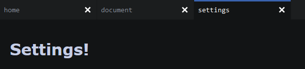

[demo](https://kachbit.github.io/Tabs-UI/demo.html) <br>
Embeddable sortable dynamic tabs. This was a fork of my previous tabs project which didn't really work at all and had way too many lines of code. This is the new and improved version that works much better and is written in much less code. It is based on a project I found on codepen ([https://codepen.io/mdcio/pen/eXppgR](https://codepen.io/mdcio/pen/eXppgR)). This was designed to be very simple and easy to use and implement into anything, just like all of my other UI components

Embedding the tabs:
--------------------
Include the CSS file at the top of the page:
```html
<link rel="stylesheet" href="src/main.css" type="text/css">
```
Use these two DIVs to ititialize the tab bar along with the .js file after:
```html
<div id="tabs"></div>
<div class='boards'></div>
<script src="./src/main.js"></script>
```
Use JavaScript to create some tabs that will be added to the tab bar:
```html
<script>
document.body.onload = () => {
    newTab('home')
    newTab('document')
    // we make the content of this tab a heading (default content is textarea with tab name)
    newTab('settings', `<h1>Settings!</h1>`)
    // assign the tab to var t
    var t = newTab('test')
}
</script>
```
**Result:**<br>


Full code:
```html
<link rel="stylesheet" href="src/main.css" type="text/css">
<div id="tabs"></div>
<div class='boards'></div>
<script src="./src/main.js"></script>
<script>
document.body.onload = () => {
    newTab('home')
    newTab('document')
    newTab('settings', `<h1>Settings!</h1>`)
    // assign the tab to var t
    var t = newTab('test')
}
</script>
 ```
Removing a tab programatically:
```javascript
var t = newTab('test')
// removes the tab
remTab(t)
```
Methods:
--------------------
* ``select(tab)`` selects a given tab
* ``remTab(tab)`` removes a given tab
* ``selectedTab()`` returns the selected tab
* ``tabList()`` returns a nodeList of all tabs
* ``newTab(title, innerHTML)`` creates a new tab with given title, and sets the content of that tab to innerHTML
* ``getPanel(tab)`` returns the corresponding content panel for a given tab 
--------------------
I may implement this into react later on.<br><br>
Took me around a day to make (4/23/22 sat)
